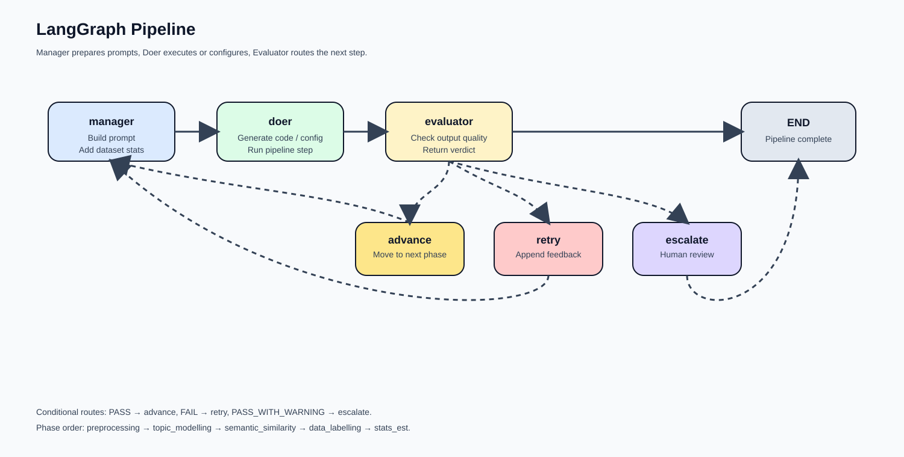

# Multi-Agent System for Automated Currency Assessment of Unstructured Text

Implementation of a LangGraph-based multi-agent pipeline for measuring information currency in financial news data, developed as part of a Master's thesis in Information Systems at HWR Berlin.

The system automates the currency assessment methodology proposed by Hristova et al. (2025) through a three-agent architecture (Doer, Evaluator, Manager) that executes preprocessing, topic discovery, semantic similarity scoring, data labelling, and survival analysis.

---

## Pipeline Overview



```
Input: Financial News Headlines (NIFTY dataset, 411,623 records)
│
├── Stage 0/1: Preprocessing (text cleaning, normalisation)
├── Stage 2: Topic Modelling (BERTopic + UMAP + HDBSCAN)
├── Stage 3: Semantic Similarity (Sentence-BERT embeddings)
├── Stage 4: Data Labelling (LLM-based binary classification)
└── Stage 5: Survival Analysis (parametric distribution fitting)
│
Output: Topic-specific currency decay functions
```

---

## Multi-Agent Architecture

| Agent | Model | Role | Temperature |
|-------|-------|------|-------------|
| Doer | Qwen 3 8B | Code generation and task execution | 0.1 |
| Evaluator | GPT OSS 120B | Independent quality verification | 0.1 |
| Manager | Qwen 3 14B | Domain context and escalation guidance | 0.3 |

**Routing logic:**
- PASS → advance to next stage
- FAIL → retry with feedback (max 3 attempts, Manager intervenes on attempt 3)
- PASS_WITH_WARNING → human review (accept or edit)
- 3 consecutive FAILs → escalation report for human

---

## Repository Structure

```
.
├── main.py                  # Pipeline entry point
├── agents/
│   └── api.py                # Agent API calls (OpenRouter)
├── graph/
│   ├── state.py               # Pipeline state definition and phase sequence
│   ├── nodes.py                # Manager + Doer node logic
│   ├── evaluator.py             # Evaluator node logic
│   ├── routing.py               # Verdict routing and state transitions
│   ├── executor.py               # Code extraction and subprocess execution
│   ├── validator.py               # Output validation summaries
│   └── prompts.py                  # Prompt loading utilities
├── prompts/
│   ├── system/                # Agent identity prompts (Doer, Evaluator, Manager)
│   ├── tasks/                   # Stage-specific task prompts and evaluation criteria
│   └── tools/                     # Reference guides (BERTopic, preprocessing, etc.)
├── outputs/
│   ├── preprocessing/
│   ├── topic_modelling/
│   ├── sbert_output/
│   ├── data_labelling/
│   └── survival_analysis/
├── logs/                     # Raw responses, generated code, evaluator verdicts
├── data/
│   └── NIFTY.xlsx             # Source dataset
├── requirements.txt
└── self_written_scripts/*.py  # scripts where the agent struggled or only required a one-time implementation, written by hand
```

---

## API Configuration

| Provider | Endpoint | Purpose |
|----------|----------|---------|
| OpenRouter | `https://openrouter.ai/api/v1/chat/completions` | All agent LLM calls (Stages 0–5) |
| HuggingFace Router | `https://router.huggingface.co/v1` | Embedding model inference (Stages 2, 3) |

Requires `.env` file with:

```
OPENROUTER_TOKEN=your_token_here
```

---

## Installation & Usage

```bash
pip install -r requirements.txt
python main.py
```

The pipeline executes all stages sequentially. Intermediate outputs are stored in `outputs/` and agent logs in `logs/`.

Individual stages can be re-executed by adjusting the initial phase index in `state.py`.

---

## Key Technologies

- **LangGraph** — directed graph orchestration with conditional routing
- **BERTopic + UMAP + HDBSCAN** — unsupervised topic discovery
- **Sentence-BERT** ( `all-MiniLM-L6-v2`) — document embeddings and similarity
- **SciPy** — parametric survival distribution fitting
- **Pandas / NumPy** — data processing across all stages

---

## Research Context

**Thesis:** Automated Currency Assessment of Unstructured Text Data Using Multi-Agent Systems

**Research Question:** How can a multi-agent system automate the currency assessment of unstructured text data?

**Key Finding:** The system achieves 83% end-to-end autonomous completion (5/6 stages), with Stage 5 requiring human intervention due to subjective labelling dependencies that exceed automated correction capacity.